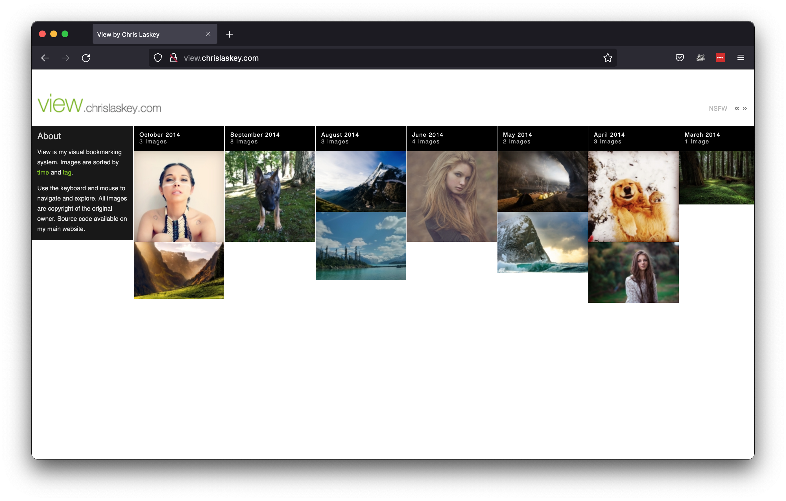
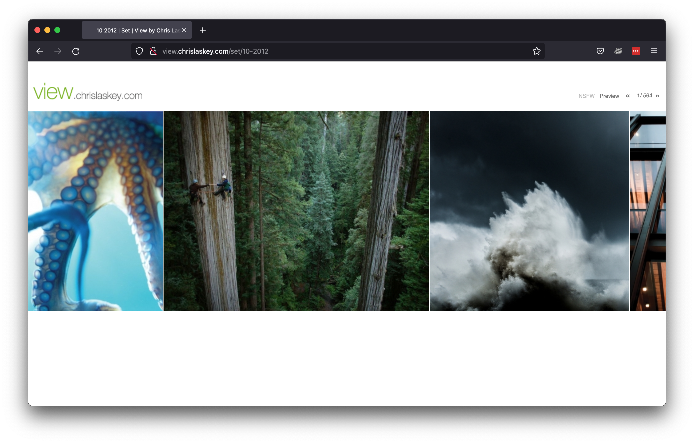
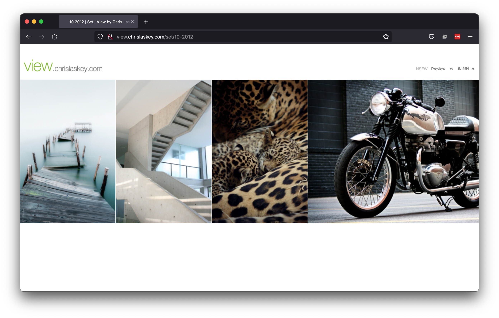

# view.chrislaskey.com

> **NOTE**: This is an archive of an application built in 2010. Found on
> a decommissioned server.
>
> Added to GitHub for the historical perspective. Code is outdated and not
> secure. Please do **not** try to run this.



## About

Similar to Pinterest, View was a custom application that could capture images
from the web. Each image linked back to the original URL. Supported features
like tagging and automatic grouping by month.

Images could be added two ways:

- By submitting a form with a link to the image through an admin panel in the web interface.
- By using the API and matching Chrome extension. Then extension would parse
  the current DOM, find the largest image, then send it and page meta data to
  an API endpoint where it would be captured in the site.

The application interface was designed to be horizontal. Images could be
scrolled by:

- Using the mouse (click right half of image to go forward, click left half of
  image to go back)
- Using the keyboard (right/left arrows)

Built with a combination of in CodeIgniter, PHP, and jQuery. Chrome extension
was JavaScript.

## More screenshots





## Original readme

```
Getting Started
==========================================

1. Create a new database and load table structure found in database_structure.sql
2. Add new database connection information to ./application/config/database.sample.php
3. Add config information to ./application/config/constants.sample.php
```
